# Facial-Recognition-Door-Lock

Want to see who's trying to enter your room? Or do you want simple keyless entry into your workshed? Too easy with this project. Uses the RPI Camera in a transparent waterproof housing. You just put it all together, we've done the code for you.

## Bill of Materials
XC9001 raspberry pi
XC9020 raspberry pi camera
LA5077 narrow door strike
WC6026 socket socket (3 Leads)
XC4514 stepdown module
XC4419 relay board
PT3002 Speaker Terminals 4 way
HB6251 Transparent polycarb case.

* You will also need a 12v power supply.

#### Optional:
* XC4983 SD card
* XC9030 Noobs SD card

## Connection diagrams

The general schematic to the design is below.

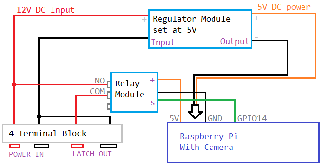

In all, it's a fairly simple set up. The rpi is provided power via the XC4514 regulator module, and drives a small relay which will shunt input power (+12v) to the door strike when needed. To control the relay, we use the RPi Camera running facial recognition code, from the face_recognition library by [@ageitgeu](https://github.com/ageitgey/face_recognition)

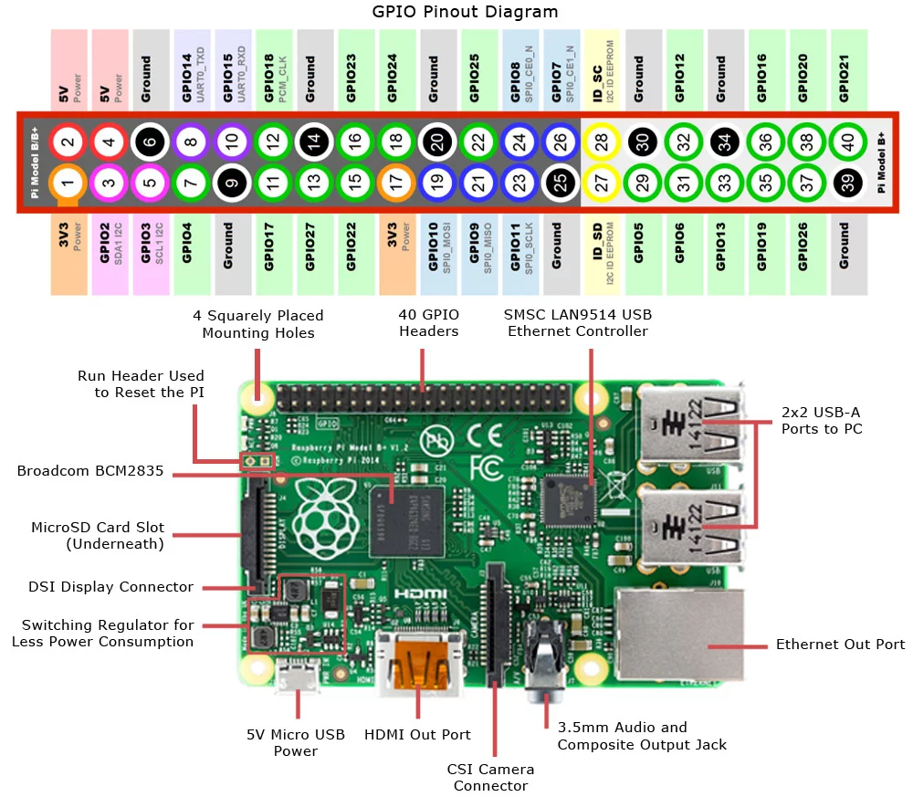

## Programming

Putting the software on the raspberry pi can be a bit of a tricky task, but we've made a script to make it easier to manage.
Firstly, pull the repository onto your pi, using the terminal. You can open the terminal by pressing `alt-f2` and typing `lxterminal`.

Then on the window that shows up, type (case sensitive):
```sh
git clone https://github.com/Jaycar-Electronics/Facial-Recognition-Door-Lock
```
once that has finished, run the setup.sh script:

```sh
cd Facial-Recognition-Door-Lock
./setup.sh
```
Leave it for a bit, it should set the program up for you then restart the raspberry pi.

While it's running, feel free to go through the [Assembly Instructions](#Assembly) and build the rest of the housing before placing the rpi in.


**Make sure to jot down the IP address through the `ifconfig` command.** There is no screen once it is all mounted, so we will have to remote into the device to make changes.

#### Technical information
The code itself is easy enough to follow and has 3 main parts:

`doorlock.py`
This is the script that pulls it all together and creates a webserver that you can issue commands to/from.

`functions.py` is the script which outlines the functions for access granted, denied, and contains the main camera/detect loop. This is the script that contains the GPIO controlling code.

`identifier.py`
This is the python object that manages the user identities, such as who is allowed in and what they look like

We've commented the code as much as possible, so check out the scripts and get a feel for what's happening if you want to modify any of the program.

The software uses `Sanic` which is a fork of the `Flask` python library, to work with asynchronous calls through the new async libraries introduced in Python3.5

Ideally, raspbian would be up to Python3.7 by now, but unfortunately, and to make the whole process a little easier to install, we're stuck on 3.5 untill raspbian update their repositories, or if someone wants to submit a "install python3.7" script that will *just work* (tm)

Clientside is done by [Vue-Bootstrap](https://bootstrap-vue.js.org/) which makes it very easy to build dynamic displays.

## Assembly Instructions

We've tried to make this a little easier without having to buy a tonne of screws and to make it fairly waterproof, but there's always room for improvement; feel free to grab some [HP0418](https://jaycar.com.au/p/HP0418) with nuts and washers and mount the acrylic and camera(2mm size) proper.

For our purposes though, these work well:

#### Cut acrylic

The width of the HB6251 is 80mm wide, so we're aiming to cut an acrylic panel atleast 80mm wide so that it can fit snuggly into the case. Start by marking a line straight across one of the edges of the acrylic, 80mm in from the edge.

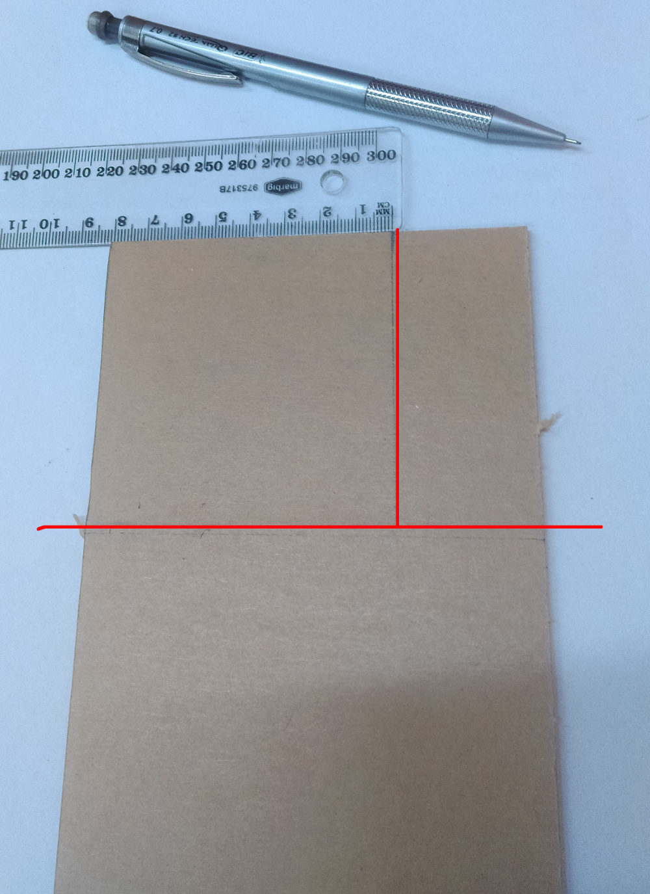

We're using our offcut in the image above but the idea is the same. We're going to be breaking the acrylic on the bench so the line needs to run from both ends of the acrylic so the cut can work properly. You can also mark another 80mm going from the edge to the first line: Once you make the first break, then you can make the second break with the line going from edge to edge.

Once the lines are marked, *score* them with a sharp knife, by running it along the lines to make a bit of a groove. you can use the ruler to keep the knife on point, and if you're young, get an adult to help you, because safety is important.

With the groove in place, simply place the acrylic on the edge of a bench, with the bigger side on the bench, and push down on the offcut while holding the larger piece. This will break the acrylic along the groove and separate the two pieces.

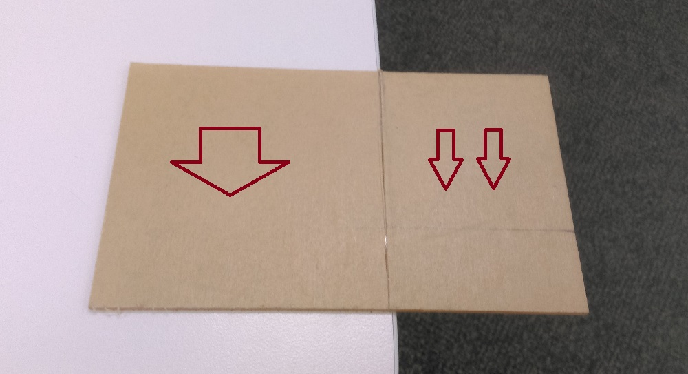

Repeat the process again for the second line, so you should have a small piece of acrylic atleast 80mm on one side. You can peel of the brown paper if you want to have a clear acrylic piece.

#### Prepare regulator

Solder some wires to the regulator, such that the output side has the socket connections still on them so they can plug into the RPi. The input side should have bare wires going to it, as we'll be connecting this to the stereo connector ([PT3002](https://jaycar.com.au/p/PT3002)) later.

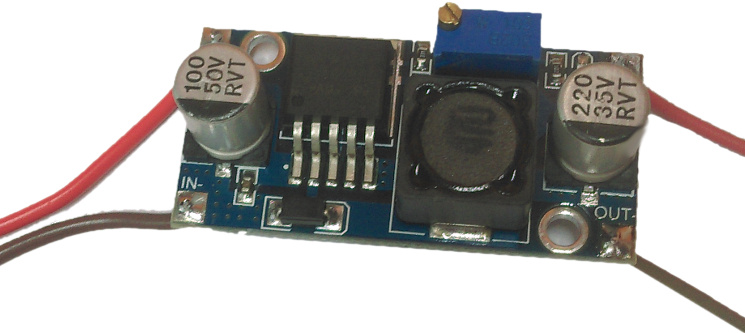

Connect up the regulator to a power supply and a multimeter; we want to set the voltage on the regulator to a stable `5v`. The good thing about this regulator is that it is very stable and should not fail in the case of giving too much power to the RPi.

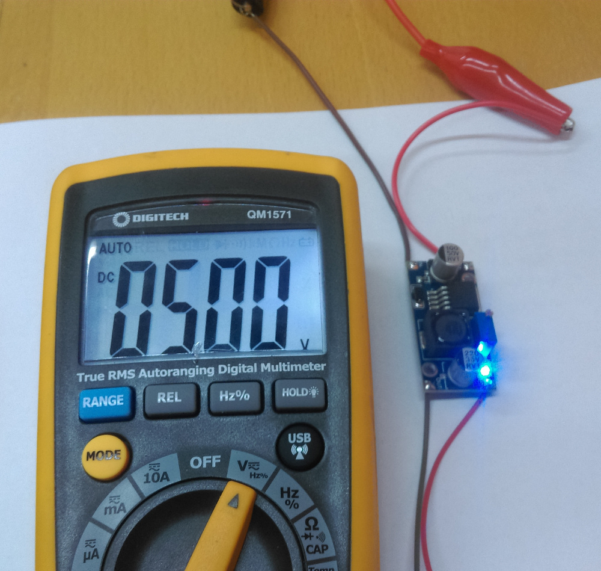

The regulator does a great job of providing the current and stable voltage that we need.

As we are using a 3B+ model pi, it appears that the RPi does not boot properly when powered off the GPIO, as originally intended. The best method of powering the pi would be to cut and strip a spare Micro USB lead so that you can attach that to the output of the Regulator module instead of the GPIO Pins. Do some testing to see that your RPI boots up with the green light flashing through your power method before you continue to mounting.

#### Mounting

Here we just used our double-sided tape to position the regulator, relay, and camera onto the acrylic base. You could use screws and nylon washers here to make a bit more of a professional mount / display.

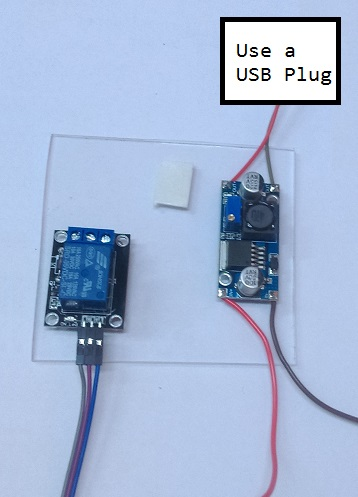

In the picture above, we didn't attach the camera. That will go on last once it is plugged into the RPi.


#### Terminal block.

The terminals are easy to place. Simply drill 4 holes in the housing to line up with each of the terminals. If you want to make the entire assembly a tad more waterproof, you can drill them underneath the unit for when you mount it to the wall, which will cover up the holes to protect from watersplashing.

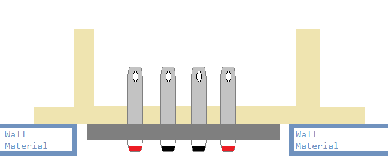

Remember that one Red/Black pair will be the power in, and the other will be output for the latch. You should mark this on the unit once you have mounted the terminal block (either by glue or screws) so that you do not get confused later on, otherwise the device will not turn on.

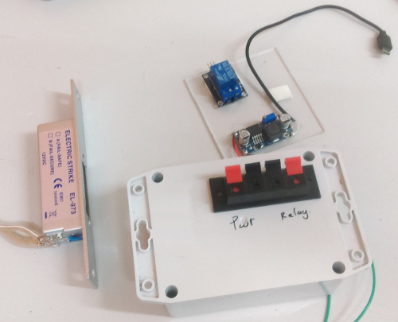

You should put this terminal block to the side so that you have enough room in the unit for the pi to fit in, around the USB cable.

Once that has been done, you can connect it all up and press the acrylic sheet in. You should find that the acrylic is fairly tight but not impossible fit against the walls of the container.

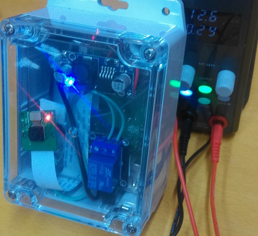

When connecting the terminals, keep in mind that there's two ways that you can connect the terminals, depending on whether you want it to be **general-case** or **active-case**. For example, if you were controlling something that ran on 5v, 48v, or something other than 12v. you would only be able to use the general case connections; as shown below.


In the general case, you would feed power *into* terminal `A` and when the signal is received (the correct face is identified) you would get power out on `B`.

However, for our purposes, it is easier to go with the active case, Where you simply connect the device (such as the door lock) to the `A` and `B` terminals, and power is automatically delivered at the right signal.

If you have connected relays before, this should be second nature to you.

## Use

Here is a screenshot of the device in use. Once it is hooked up to the network, find the device IP through your router settings or otherwise and open the page on a web-browser such as chrome.

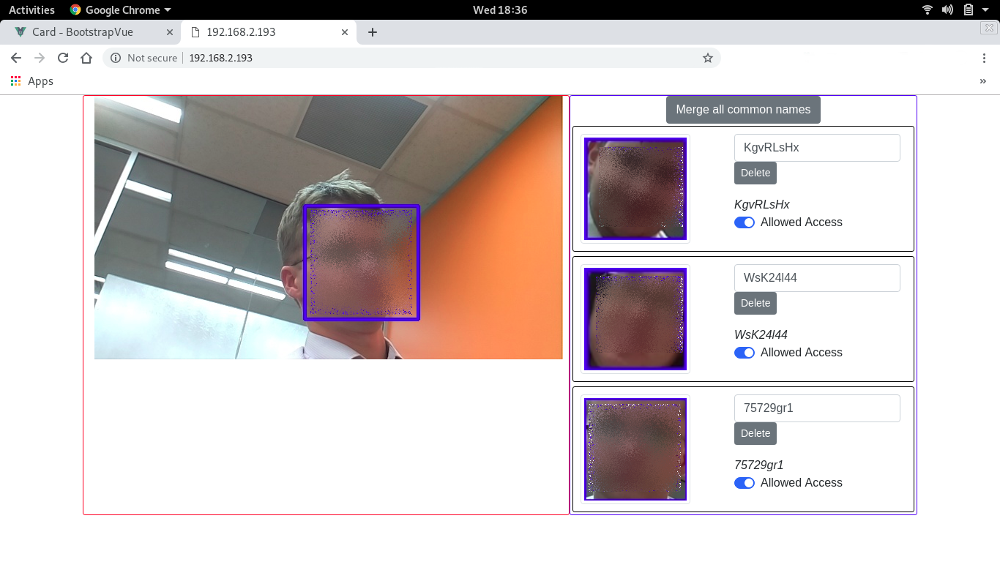

Here it will generate a thumbnail of each face that it has found and has memory of, as well as the current live feed. you can delete users and deny access.


## Future improvements

There is a wide variety of what you can do with this project; for instance, if you want to connect a speaker system to it, you can use something like [PyMedia](http://pymedia.org/) to play audio such as a voice prompt to say "access denied."

the file `functions.py` has the `accessDenied` and `accessGranted` functions that define what happens when the user is denied or granted access, in our code you can see that it turns the relay on and off.

The software could also be made to run a bit faster with some more clever asynchronous/threading; we welcome pull requests through github and are always happy to discuss the code more in depth; so if you think you have what it takes, feel free to fork the project and contribute to make a better project for all.

#### Beginner's changes
Changes that should be easy enough for beginners to start contributing:

* Identifier.py
	* Set friendly names hasn't properly been implemented yet, this should just be a dictionary entry for each uid and a string being the user's real name
	* `Merge all common names` has not been implemented
* doorlock.py
	* `Merge all common names` commands have not been implemented
	* Provide a way for the client to poll for new updates, showing new faces have been found.
* index/index.html
	* Poll the server for updates
	* Provide a better looking interface.
* functions.py
	* Show the uid or friendly name for each person shown in the blue-square. this is done on the tutorial for facial_recognition, so it should be easy enough to copy over to this project too.
	* Change the face_recognition library as it is too slow. dlib takes almost 1-2 seconds on each face_encoding;
